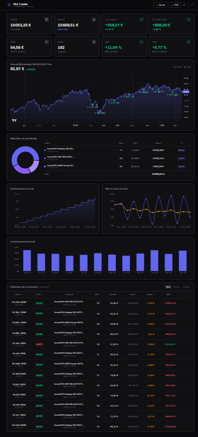
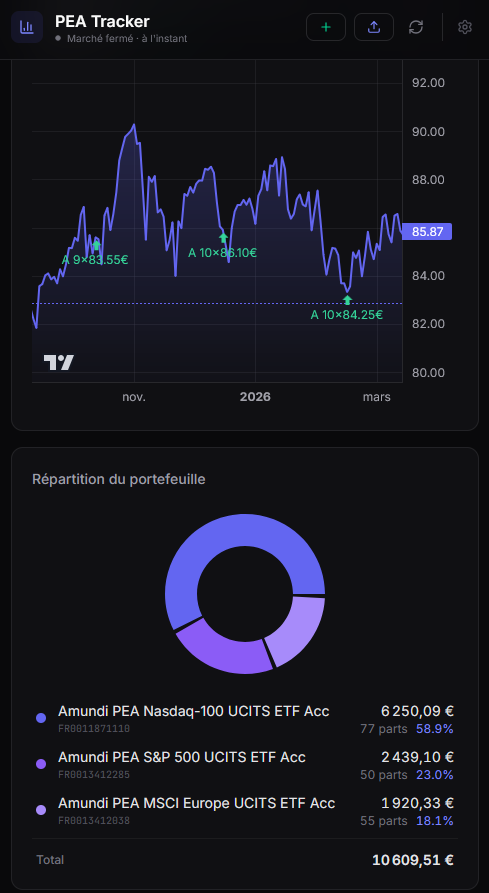

# PEA Tracker

Dashboard de suivi PEA. Import des avis d'opéré, courbes de prix, DCA, plus-value, XIRR.



<details>
<summary>Mobile</summary>



</details>

## Setup

```bash
npm install
cp .env.example .env
npm run dev
```

## Fonctionnement

- **Import PDF** — drag & drop des avis d'opéré BoursoBank, parsing auto
- **Saisie manuelle** — recherche Yahoo Finance intégrée
- **Courbe de prix** — graphique interactif avec markers achat/vente
- **KPIs** — investi, valeur, +/- value, frais, XIRR, TWR
- **DCA** — investissement cumulé, PRU, montants mensuels
- **Répartition** — donut + tableau des positions
- **Thème** clair / sombre
- **Responsive** mobile

## Parsers PDF

Le parsing est calé sur le format BoursoBank. Pour un autre broker, saisie manuelle ou ajout d'un parser dans `src/lib/pdf-parser.ts` — retourner un objet `Transaction` :

```ts
{ id, date, time, type, name, isin, quantity, price, grossAmount, commission, fees, netAmount, market, reference }
```

## Sync cloud

Optionnel, via Supabase :

1. Créer un projet sur [supabase.com](https://supabase.com)
2. Run le SQL de `supabase/migrations/001_create_transactions.sql`
3. Activer l'auth Email (magic link)
4. Remplir le `.env`

Sans ça, tout reste en local.

## Déploiement

```bash
vercel
```

Ajouter les env vars Supabase dans le dashboard Vercel.

## Stack

React · TypeScript · Vite · Tailwind CSS · Lightweight Charts · Recharts · pdfjs-dist · Supabase · Vercel
